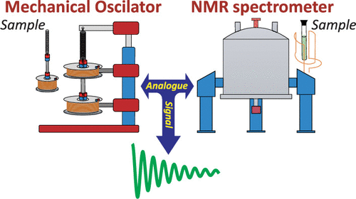

We present a nuclear magnetic resonance (NMR) analogue consisting of a damped and forced oscillating magnet, with oscillation triggered and damping controlled using two coils and an ATmega2560 microcontroller-based circuit. The analogue effectively emulates various 1D and 2D detection conditions, including the impact of changes in spin precession frequency and different transverse relaxation modes. We demonstrate its capabilities by simulating common NMR scenarios such as simple oscillations, exponential, stretched exponential, and Gaussian decaying signals, as well as the acquisition of 2D relaxation maps. The system’s flexibility allows for easy modification of acquisition parameters via an intuitive interface, highlighting the analogue’s potential as a valuable educational resource for teaching NMR principles.

# Reference

Bruno Trebbi, Luiz Antônio de Oliveira Nuness, Mateus José Martins, Eduardo Ribeiro deAzevedo, J. Chem. Ed., 2025, [doi.org/10.1021/acs.jchemed.5c00517](https://doi.org/10.1021/acs.jchemed.5c00517)

