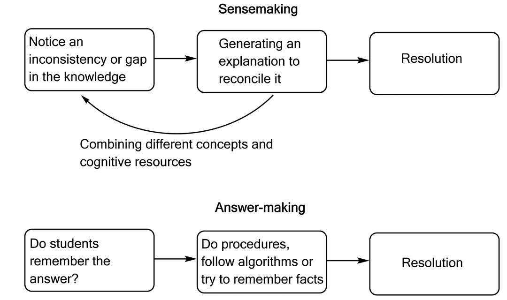

Sensemaking is an important way of learning and engaging in science. Research has shown that sensemaking activities, such as questioning, hypothesizing, and model building, are pivotal in developing critical thinking and problem-solving skills in science education. This paper investigates the role of computational simulations in facilitating sensemaking in chemistry education, specifically examining how these simulations can sustain the sensemaking process. Through a detailed case study in a physical chemistry course, we explore the interplay between students&rsquo; real-world experiences, theoretical knowledge, and computational simulations. This analysis reveals that computational simulations, by providing interactive and visual representations of chemical phenomena, can create a conducive environment for sensemaking, where students actively engage in exploring and resolving conceptual uncertainties. Based on these results, we argue that computational tools, when effectively integrated into educational settings, can facilitate sensemaking in science education.

# Reference

Haraldsrud and Odden, Chem. Educ. Res. Pract., 2024, [doi:10.1039/D4RP00017J](http://dx.doi.org/10.1039/D4RP00017J)

