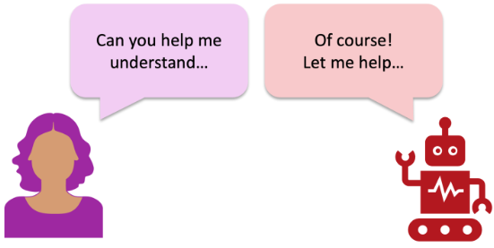

Generative artificial intelligence (GenAI) has the potential to drastically alter how we teach and conduct research in chemistry education. There have been many reports on the potential uses, limitations, and considerations for GenAI tools in teaching and learning, but there have been fewer discussions of how such tools could be leveraged in educational research, including in chemistry education research. GenAI tools can be used to facilitate and support researchers in every stage of traditional educational research projects (e.g. conducting literature reviews, designing research questions and methods, communicating results). However, these tools also have existing limitations that researchers must be aware of prior to and during use. In this research commentary, we share insights on how chemistry education researchers can use GenAI tools in their work ethically. We also share how GenAI tools can be leveraged to improve accessibility and equity in research.

# Reference

Deng JM, Lalani Z, McDermaid LA, Szozda AR. Using generative artificial intelligence in chemistry education research: prioritizing ethical use and accessibility. ChemRxiv. Cambridge: Cambridge Open Engage; 2023; This content is a preprint and has not been peer-reviewed.

<https://doi.org/10.26434/chemrxiv-2023-24zfl>

KEYWORDS:Generative AI, Education, ChatGPT, Use of AI, AI Integration, Tools, Technology, Chemistry Education Research

