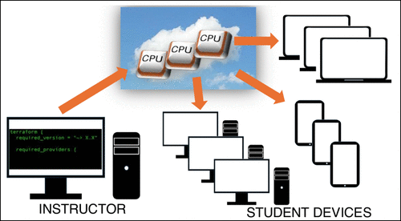

In this work we provide an infrastructure as code (IaC) template for running computational laboratories in the cloud to improve access to computational resources for both students and instructors. Specifically, we provide a Terraform code that provisions resources in Amazon Web Services (AWS). The instructor can create a virtual machine (an “instance”) per student and have the necessary software automatically installed upon instance creation using a customizable script. Students can access the instance via a command line interface using the AWS Management Console within any standard web browser on any device. Files can be uploaded (downloaded) to (from) the instance by the student via a web browser. We outline example workloads including open-source molecular dynamics and quantum chemistry programs.

# Reference

Nicolas D. Winter, Alexandra R. Richards, *J. Chem. Educ.*, 2026, [doi.org/10.1021/acs.jchemed.6c00015](https://doi.org/10.1021/acs.jchemed.6c00015)

