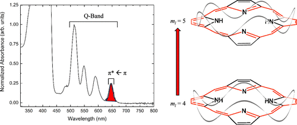

Experiments that explore quantum principles while utilizing and reinforcing previous synthesis skills are excellent for engaging students and promoting the interconnected nature of chemistry. This experiment utilizes sophomore-level organic synthesis techniques to have students produce their own meso substituted porphyrins. The UV–vis absorption spectrum of the porphyrins is then collected and using the lowest π\* ← π transition energy, the size of the conjugated circular π system and the length of a conjugated C–C bond can be calculated using the quantum particle-on-a-ring wave functions and energies. The model slightly overestimates the circumference of the ring and the C–C bond length. Students can then see and rationalize that there are clear molecular orbital considerations and substitution effects that cause these overestimations. With the ability to synthesize multiple substituted porphyrins and potentially insert metal cations, as well, this experiment offers a flexible and engaging way for physical chemistry students to synthesize their own molecules in the service of exploring quantum theory.

# Reference

Courtney H. Deslauriers and Benjamin J. Knurr, Journal of Chemical Education, 2024,
[10.1021/acs.jchemed.4c00017](https://doi.org/10.1021/acs.jchemed.4c00017)

