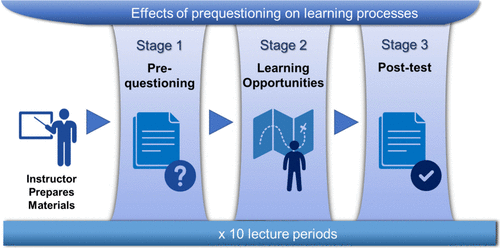

*Prequestioning* is a learning strategy that involves taking practice tests on to-be-learned information, followed by studying the correct answers. Despite promising results in laboratory studies, it has rarely been examined in authentic educational settings. In this activity, we implemented prequestioning as an interactive, hands-on activity in a small undergraduate environmental chemistry course. Across 10 lecture sessions, the instructor administered four prequestions targeting concepts to be covered in the upcoming lecture. Students attempted to guess the answers to each question before the lecturer presented the correct answers. On assessments occurring during the next lecture session, there was evidence of a prequestioning effect, that is, better performance on questions targeting prequestioned concepts versus non-prequestioned concepts, in most cases. The observed benefit of prequestioning highlights the potential utility of this strategy as a useful and affordable activity for enhancing learning in undergraduate chemistry and other similar courses.

# Reference

Steven C. Pan, Jia Yi Han, Fun Man Fung, *J. Chem. Educ.*, 2025, [doi.org/10.1021/acs.jchemed.4c01405](https://doi.org/10.1021/acs.jchemed.4c01405)

