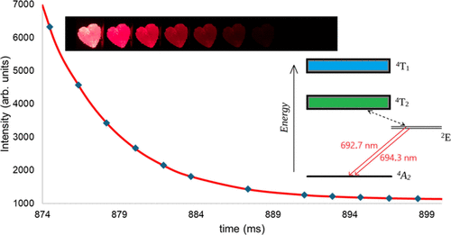

This short article describes a safe way of observing the emission decay from a ruby crystal using a photographic flash. This demonstration does not require the use of lasers and can be easily and safely performed in a classroom or a home setting. The ruby sample was optically excited with a short-duration photographic flash, and the subsequent relaxation of the excited state population through intermediate metastable states was monitored using three different types of slow-motion digital cameras. Monitoring the recorded video frames allowed visualization of the population decay kinetics. In addition, the measurement of frame intensities allowed for the computation of the excited state lifetime and decay rate constant. This demonstration can be utilized in several different chemical education courses at the advanced high school or undergraduate level, for example, in the courses that involve concepts related to photochemical reaction kinetics, flash photolysis, lasers, etc.

# Reference

Dinesh Dhankhar, *J. Chem. Educ.*, 2025, [doi.org/10.1021/acs.jchemed.4c01529](https://doi.org/10.1021/acs.jchemed.4c01529) 

