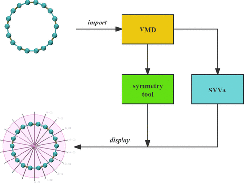

Symmetry, a common occurrence in nature, holds significant importance in the realm of chemistry education. However, students often struggle to visualize the symmetry elements of three-dimensional molecules and identify point groups using traditional textbooks. In order to address this challenge, we integrated SYVA into VMD for accurate determination of molecular point groups. Additionally, we have organized molecular point group materials to serve as an educational resource. The resource currently includes hundreds of unique molecules, with continuous expansion, to effectively demonstrate various symmetry elements within molecules and aid in determining point groups. Expanding on this resource, we have designed an educational activity focused on molecular symmetry. According to student feedback, utilizing VMD to showcase molecular point group files and visually represent molecular symmetry elements is beneficial for students in comprehending related concepts. This resource can serve as a valuable tool for teaching symmetry, offering interactivity, visual appeal, and offline accessibility, allowing for flexible use across different times and locations.

# Reference

J. Chem. Educ. 2024, [doi 10.1021/acs.jchemed.4c00530](https://doi.org/10.1021/acs.jchemed.4c00530)

