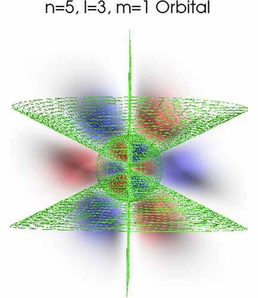

Despite the prominence of orbitals throughout the undergraduate chemistry curriculum, high-quality visualization of atomic orbitals is out of reach for most scientists. Rigorously visualizing the atomic orbitals even for simple hydrogen-like atoms and ions is rather challenging due to the complex 3-D structure and geometric variability of the orbitals across three distinct quantum numbers. In this work, a graphical user interface (GUI)-based tool for visualizing 3-D volumetric density plots of hydrogen atomic orbitals is introduced. This tool is written in Python, and a Jupyter notebook version with explanatory blocks interspersed in the code is included for pedagogical purposes. The user can manipulate a large number of features using the GUI, which allows customization of the orbital illustrations. Because this visualizer is capable of visualizing orbitals with any quantum numbers and showing their nodal surfaces, it can serve as a supplement to students’ lecture and textbook education on this topic.

# Reference

M. D. Hanson, *J. Chem. Educ.*, Article ASAP 2024, [DOI:10.1021/acs.jchemed.4c00547](https://doi.org/10.1021/acs.jchemed.4c00547)

Github repository: [https://github.com/mhanson12363/Atomic-Orbitals-Visualizer/tree/main](https://github.com/mhanson12363/Atomic-Orbitals-Visualizer/tree/main)

