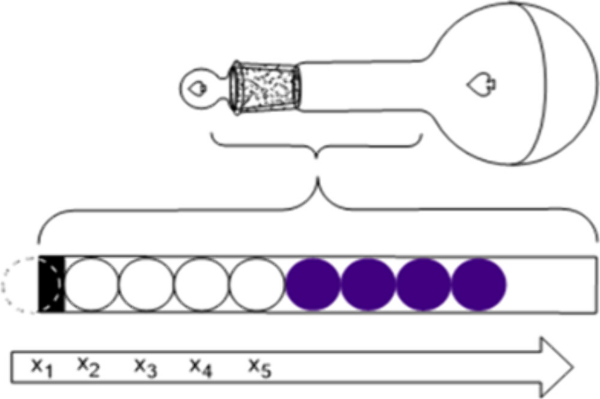

The microstates of an isolated system indicate the different distributions of the energy of a system over the set of particles of the system. Microstates with the same (quantum states) occupation number form a configuration set. All microstates have the same probability of occurrence. Students determined the probability distribution of the configurations in a model experiment demonstrating the ergodic theory. The model experiment required a volumetric flask with white and blue plastic balls. The sequential order (repeated permutation) of the plastic balls in the neck of the flask corresponds to a microstate. The experiment was performed after the theoretical lecture.

# Reference

Mihalj Poša, *J. Chem. Educ.* 2024, [doi.org/10.1021/acs.jchemed.4c00496](https://doi.org/10.1021/acs.jchemed.4c00496)

