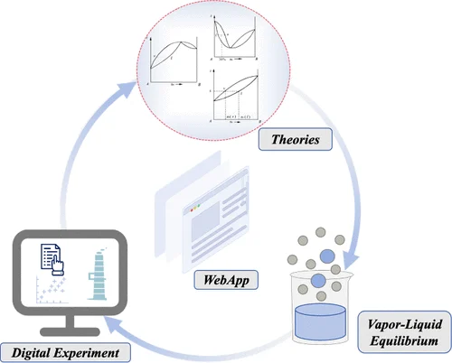

The understanding of vapor–liquid equilibrium (VLE) is of great importance as it provides data and theoretical support for applications in chemical and environmental engineering. Undergraduates in Chemistry and Chemical Engineering are expected to be capable of understanding, drawing and applying VLE phase diagrams. In this paper, we built theoretical models for VLE calculations and distillation column design for binary systems. VLE theory (Raoult’s Law), activity models, and Antoine equations were used, with parameters from literature. Using technology frameworks react.js and d3.js, we developed an interactive and user-friendly WebApp for students to explore VLE and distillation. This WebApp covers typical binary systems and visualizes the results as graphs, tables, and animated cartoons as users play with the system and operating parameters. Our intention with implementing this WebApp is that, through deepened and broadened explorations, students will enhance their understanding in VLE knowledge and will be able to learn in their own way and pace individually; however, the effectiveness should be studied through rigorous education research.

# Reference

Yingchun Liu, Yingchun Liu, Tingting Liu, Yinan Zhang, Xinkai Lu, Qi Wang, Yun Long, *J. Chem. Educ.* 2026, [doi.org/10.1021/acs.jchemed.5c01256](https://doi.org/10.1021/acs.jchemed.5c01256)

