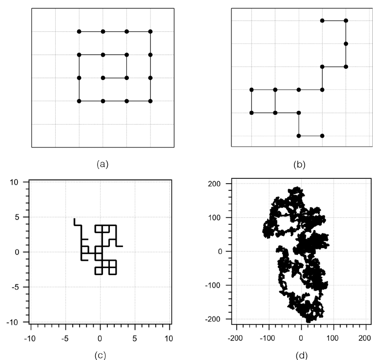

# What is this experiment about?

Using viscosity measurements and a simple modeling exercise, students discover that a random walk model can describe the viscosity observations for polyvinyl alcohol in water. This experiment helps meet the increasing expectation for polymer chemistry in the chemistry curriculum. It further allows students to see the connection between macroscopically observable quantities, such as viscosity, and models of the underlying molecular structure. This experiment provides a strong introduction to polymer structure for students who have had no previous experience with the topic.

# What do students do?

Students measure the viscosity of solutions of polyvinyl alcohol (PVA) in water using a calibrated viscometer using samples with a range of molecular weights. They use their data to determine the radius of particles in solution, and discover that the radius scales as the square root of the chain length rather than the cube root that would be expected if the particles were spherical. Students then perform a random walk analysis, first on paper and (optionally) with a computer, to discover that the size of a random walk scales as the square root of the number of steps taken. Students then analyze the appropriateness of the random walk model for polyvinyl alcohol dissolved in water.

# What equipment and supplies will you need?

-   About one gram of each of four samples of PVA with molecular weights is sufficient to make solutions for 10-20 student teams.
-   Cannon-Fenske viscometers or another way of measuring viscosity. Note that temperature control is not necessary.
-   A balance and standard volumetric glassware
-   For modeling and data analysis, students will need graph paper and spreadsheet software. Students can use four-sided dice or spreadsheet functions to construct the random walk model.

# What makes this experiment a physical chemistry experiment?

The experiment has students calibrate and use an instrument that is likely new to them. They use their data to consider and think deeply about more than one physical model for macromolecules. Students are also prompted to consider how solute-solute, solute-solvent, and solvent-solvent interactions affect the structure of a dissolved polymer.

# And what makes it a POGIL-PCL experiment?

Students make predictions and develop hypotheses about the nature of polymer behavior. Students share data to have a full set of data for polymer behavior in solution. They are surprised that the data do not conform to their predictions. Students use graphical representations to analyze the data and mathematical and conceptual models to test their hypotheses about the polymer behavior.

# Reference

Michael A. Everest and Abigail J. Toves, Westmont College, Santa Barbara, CA;  Melissa S. Reeves, Tuskegee University, Tuskegee, AL

Journal of Chemical Education, 2023, 100 (7), 2719-2723. [doi:10.1021/acs.jchemed.2c01155](https://doi.org/10.1021/acs.jchemed.2c01155)

[View student handout](https://chemistry.coe.edu/piper/pclform.html?expt=polymerViscosity)

The Instructor’s Handbook with implementation details, sample data, and expected answers is available through the [POGIL-PCL project](https://www.pogilpcl.org/get-connected). 

